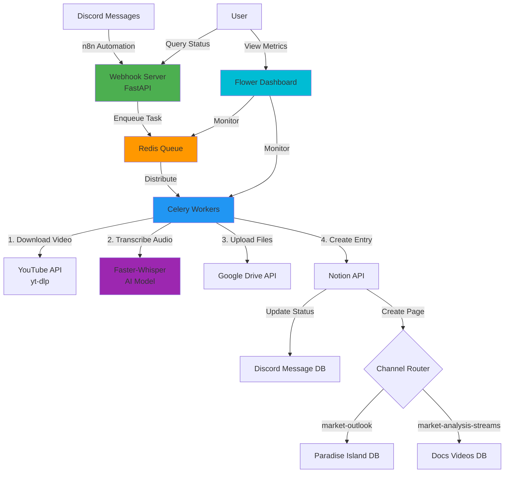
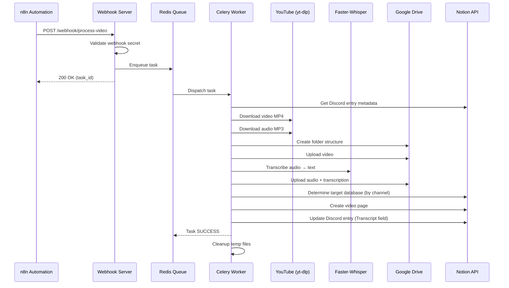
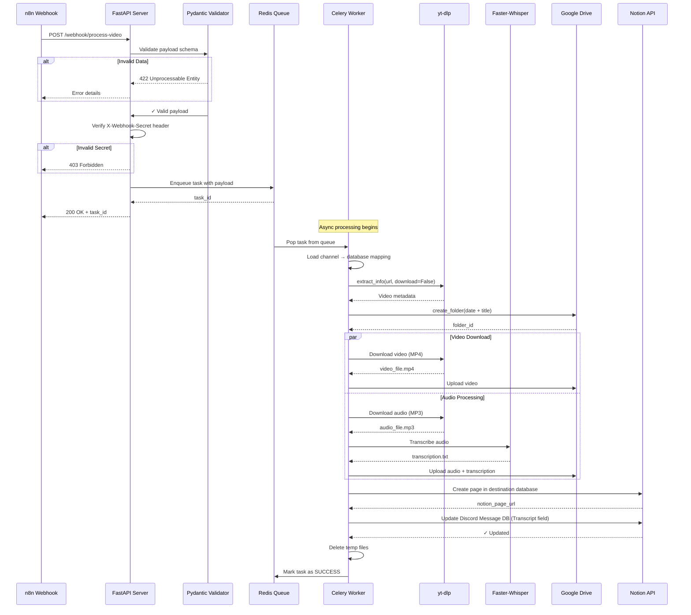

# YouTube to Notion Video Processing System - Technical Documentation

## 1. Project Overview

### Name and Purpose

**YouTube to Notion Video Processing System** is an enterprise-grade automation pipeline designed to download YouTube videos, transcribe their audio content using AI, and organize all resulting artifacts in Google Drive while maintaining synchronized metadata in Notion databases.

### Context

This system operates as a **webhook-driven microservice** designed for B2B knowledge management workflows. It integrates with:
- **Discord** (via n8n automation): Source of video URLs from community channels
- **Notion**: Database-as-a-service for metadata management and workflow tracking
- **Google Drive**: Cloud storage for video files, audio tracks, and transcriptions
- **Celery + Redis**: Distributed task queue for asynchronous processing

**Primary Use Case**: Automated processing of market analysis videos and educational content shared in Discord channels, making them searchable and accessible through Notion databases.

### Key Features

- ✅ **Automated YouTube Download**: Robust downloading with `yt-dlp`, avoiding SABR errors via mobile client emulation
- ✅ **AI-Powered Transcription**: Faster-Whisper integration with 3-4x GPU acceleration and 50% VRAM reduction vs. OpenAI Whisper
- ✅ **Intelligent File Organization**: Hierarchical Google Drive structure with automatic duplicate detection
- ✅ **Multi-Database Notion Integration**: Dynamic routing to different databases based on Discord channel source
- ✅ **Webhook API**: RESTful FastAPI server for n8n integration with authentication
- ✅ **Distributed Task Processing**: Celery workers with automatic retry logic and exponential backoff
- ✅ **Real-time Monitoring**: Flower dashboard for task visibility and performance metrics
- ✅ **Production-Ready**: Comprehensive error handling, logging, and Docker containerization

---

## 2. Architecture and Technical Design

### System Architecture Diagram



### Component Interaction - Sequence Diagram



### Technology Stack

| Layer | Technology | Version | Rationale |
|-------|-----------|---------|-----------|
| **Language** | Python | 3.10+ | Modern async support, rich AI/ML ecosystem |
| **Web Framework** | FastAPI | 0.104+ | High performance, auto-generated OpenAPI docs, type validation |
| **Task Queue** | Celery | 5.3+ | Industry-standard distributed task processing |
| **Message Broker** | Redis | 7.x | In-memory performance, persistence support |
| **Transcription** | Faster-Whisper | 1.0+ | 3-4x faster than OpenAI Whisper, lower VRAM usage |
| **Video Download** | yt-dlp | 2024+ | Active fork of youtube-dl, avoids SABR errors |
| **Data Validation** | Pydantic | 2.5+ | Runtime type checking, data validation |
| **Monitoring** | Flower | 2.0+ | Real-time Celery task monitoring |
| **Containerization** | Docker + Compose | - | Reproducible deployments |
| **Cloud Storage** | Google Drive API | v3 | Client requirement, shared drive support |
| **Database** | Notion API | 2022-06-28 | Client's existing knowledge base platform |

### Design Patterns

#### 1. **Repository Pattern** (`src/notion_client.py`, `src/drive_manager.py`)
- **Purpose**: Abstraction layer between business logic and external APIs
- **Implementation**: `NotionClient` and `DriveManager` classes encapsulate all API interactions
- **Benefit**: Easy to mock for testing, centralized error handling

#### 2. **Strategy Pattern** (`config/notion_config.py`)
- **Purpose**: Dynamic database selection based on Discord channel
- **Implementation**: `CHANNEL_TO_DATABASE_MAPPING` dictionary + `get_destination_database()` function
- **Benefit**: Add new channels/databases without modifying core logic

#### 3. **Decorator Pattern** (`utils/helpers.py`)
- **Purpose**: Cross-cutting concerns (retry logic, logging)
- **Implementation**: `@retry_on_failure` decorator with exponential backoff
- **Benefit**: DRY principle, consistent retry behavior across codebase

#### 4. **Template Method Pattern** (`src/tasks.py`)
- **Purpose**: Define skeleton of video processing algorithm
- **Implementation**: `process_youtube_video()` defines steps, delegates to specialized classes
- **Benefit**: Easy to extend processing pipeline

#### 5. **Factory Pattern** (`src/models.py`)
- **Purpose**: Object creation with validation
- **Implementation**: `VideoInfo.from_url()`, `DriveFile.from_api_response()`
- **Benefit**: Type safety, centralized validation logic

### Directory Structure

```
Youtube-to-notion-whisper/
│
├── config/                          # Configuration management
│   ├── __init__.py
│   ├── logger.py                    # Centralized logging setup
│   ├── notion_config.py             # Notion databases & field mappings
│   └── settings.py                  # Environment variables & constants
│
├── src/                             # Core application logic
│   ├── celery_app.py                # Celery instance & worker configuration
│   ├── tasks.py                     # Async task definitions (main orchestration)
│   ├── webhook_server.py            # FastAPI REST API endpoints
│   ├── youtube_downloader.py        # yt-dlp wrapper for video/audio download
│   ├── transcriber.py               # Faster-Whisper audio-to-text processing
│   ├── drive_manager.py             # Google Drive API client
│   ├── notion_client.py             # Notion API client & database operations
│   └── models.py                    # Data classes (VideoInfo, MediaFile, etc.)
│
├── scripts/                         # Operational scripts
│   ├── local_transcriber.py         # CLI tool for batch transcription
│   ├── start_all.sh                 # Start all services (Redis, Worker, Webhook)
│   ├── start_worker.sh              # Launch Celery worker
│   ├── start_webhook_server.sh      # Launch FastAPI server
│   ├── start_flower.sh              # Launch monitoring dashboard
│   └── stop_all.sh                  # Graceful shutdown
│
├── utils/                           # Helper utilities
│   └── helpers.py                   # File validation, sanitization, retry logic
│
├── docs/                            # Documentation
│   ├── QUICK_START.md               # 5-minute setup guide
│   ├── NOTION_INTEGRATION.md        # Notion database configuration
│   └── CHANGELOG.md                 # Version history
│
├── input/                           # Local transcription input directory
├── output/                          # Transcription output files
├── temp_downloads/                  # Temporary storage (auto-cleaned)
├── logs/                            # Application & worker logs
│
├── credentials.json                 # Google Drive OAuth 2.0 credentials
├── token.pickle                     # Google Drive authorization token (auto-generated)
├── LinksYT.json                     # Legacy config (deprecated in webhook mode)
├── requirements.txt                 # Python dependencies
├── docker-compose.yml               # Container orchestration
└── README.md                        # User-facing documentation
```

---

## 3. Data Flow and Logic

### Main Processing Flow

**Entry Point**: Webhook receives JSON payload from n8n automation

```json
{
  "discord_entry_id": "28bdaf66daf7816383e6ce8390b0a866",
  "youtube_url": "https://www.youtube.com/watch?v=dQw4w9WgXcQ",
  "channel": "market-outlook",
  "parent_drive_folder_id": "1ABC123xyz" // Optional
}
```

#### Step-by-Step Execution

1. **Webhook Reception** (`webhook_server.py`)
   - FastAPI validates payload with Pydantic models
   - Verifies `X-Webhook-Secret` header for authentication
   - Validates YouTube URL format and channel name
   - Enqueues Celery task, returns `task_id` immediately (async processing)

2. **Task Initialization** (`tasks.py::process_youtube_video`)
   - Retrieves destination database config from channel mapping
   - Initializes service clients (YouTube, Transcriber, Drive, Notion)
   - Creates temporary download directory

3. **Video Information Extraction**
   - `youtube_downloader.py` uses `yt-dlp` to fetch metadata
   - Extracts: title, upload date, duration
   - Sanitizes title for filesystem safety (removes special chars)

4. **Google Drive Folder Creation**
   - Format: `YYYY-MM-DD - Sanitized Title`
   - Creates in specified parent folder (or root if not provided)
   - Returns `drive_folder_id` for subsequent uploads

5. **Video Download**
   - Downloads best quality MP4 (AVC1 codec preferred)
   - Uses mobile client headers to avoid YouTube SABR errors
   - Automatic retry with exponential backoff (max 10 retries)

6. **Audio Download**
   - Extracts best audio stream, converts to MP3 (192kbps)
   - FFmpeg post-processing for quality optimization

7. **AI Transcription**
   - Faster-Whisper processes MP3 with optimized parameters:
     - `beam_size=5`: Balance speed/quality
     - `condition_on_previous_text=False`: Prevents repetitions
     - `temperature=0.1`: More deterministic output
   - Real-time segment logging to console
   - Saves transcription as `.txt` file

8. **Google Drive Upload**
   - Uploads: video MP4, audio MP3, transcription TXT
   - Duplicate detection before upload (checks filename in folder)
   - Generates shareable Drive URLs

9. **Notion Database Entry**
   - Routes to correct database based on channel:
     - `market-outlook` → Paradise Island Videos Database
     - `market-analysis-streams` → Docs Videos Database
   - Creates page with properties:
     - **Name**: `YYYY-MM-DD - Video Title`
     - **Date**: Video upload date
     - **Video Link**: YouTube URL
     - **Drive Link**: MP4 file URL
     - **Google Drive Folder**: Folder URL
     - **Discord Channel**: Source channel (select)

10. **Discord Message Database Update**
    - Updates **Transcript** field with newly created Notion page URL
    - Creates bidirectional link between source and destination

11. **Cleanup**
    - Deletes temporary downloaded files
    - Logs processing metrics (duration, file sizes)
    - Returns success status with all URLs

### Critical Process - Sequence Diagram



---

## 4. Installation and Configuration Guide

### Prerequisites

| Requirement | Minimum Version | Installation |
|------------|----------------|--------------|
| **Python** | 3.10 | [python.org](https://www.python.org/downloads/) |
| **FFmpeg** | 4.x | [ffmpeg.org](https://ffmpeg.org/download.html) |
| **Docker** | 20.x | [docker.com](https://www.docker.com/get-started) |
| **Docker Compose** | 2.x | Included with Docker Desktop |
| **Git** | 2.x | [git-scm.com](https://git-scm.com/) |

**Optional (for GPU acceleration)**:
- NVIDIA GPU with 4+ GB VRAM
- CUDA Toolkit 11.8+
- cuDNN 8.x

### Environment Variables

Create a `.env` file in the project root:

| Variable | Description | Default | Required |
|----------|-------------|---------|----------|
| **NOTION_TOKEN** | Notion integration secret | - | ✅ Yes |
| **WEBHOOK_SECRET** | Custom secret for webhook authentication | `change-this-secret-in-production` | ⚠️ Change in prod |
| **WHISPER_DEVICE** | Compute device for transcription | `cpu` | No |
| **WHISPER_MODEL_DEFAULT** | Whisper model size | `small` | No |
| **WHISPER_MODEL_LOCAL** | Model for local transcription script | `medium` | No |
| **REDIS_URL** | Redis connection string | `redis://localhost:6379/0` | No |
| **WEBHOOK_HOST** | FastAPI bind address | `0.0.0.0` | No |
| **WEBHOOK_PORT** | FastAPI port | `8000` | No |
| **FLOWER_PORT** | Flower dashboard port | `5555` | No |
| **CELERY_WORKER_CONCURRENCY** | Parallel tasks per worker | `1` | ⚠️ CPU: use 1 |
| **CELERY_TASK_TIME_LIMIT** | Max task duration (seconds) | `3600` | No |
| **TEMP_DOWNLOAD_DIR** | Temporary file storage | `temp_downloads` | No |
| **LOG_LEVEL** | Logging verbosity | `INFO` | No |
| **YT_DLP_RETRIES** | yt-dlp retry attempts | `10` | No |
| **DRIVE_UPLOAD_MAX_RETRIES** | Drive upload retry attempts | `3` | No |

**Example `.env` file**:
```bash
# === REQUIRED ===
NOTION_TOKEN=ntn_1234567890abcdefghijklmnopqrstuvwxyz

# === SECURITY ===
WEBHOOK_SECRET=my_super_secret_webhook_key_xyz

# === TRANSCRIPTION ===
WHISPER_DEVICE=cuda  # Use 'cpu' if no GPU
WHISPER_MODEL_DEFAULT=small

# === REDIS ===
REDIS_URL=redis://localhost:6379/0

# === WEBHOOK SERVER ===
WEBHOOK_HOST=0.0.0.0
WEBHOOK_PORT=8000

# === WORKER ===
CELERY_WORKER_CONCURRENCY=1  # Keep at 1 for CPU, can increase for GPU
```

### Installation Steps

#### 1. Clone Repository

```bash
git clone https://github.com/esedesofiaaa/Youtube-to-notion-whisper.git
cd Youtube-to-notion-whisper
```

#### 2. Install System Dependencies

**Ubuntu/Debian**:
```bash
sudo apt update
sudo apt install -y ffmpeg python3.10 python3.10-venv python3-pip docker.io docker-compose
```

**macOS** (with Homebrew):
```bash
brew install ffmpeg python@3.10 docker docker-compose
```

**Windows**:
- Install FFmpeg from [gyan.dev](https://www.gyan.dev/ffmpeg/builds/)
- Add to PATH
- Install Python 3.10 from [python.org](https://www.python.org/downloads/)
- Install Docker Desktop from [docker.com](https://www.docker.com/products/docker-desktop/)

#### 3. Create Python Virtual Environment

```bash
python3.10 -m venv .venv
source .venv/bin/activate  # Windows: .venv\Scripts\activate
```

#### 4. Install Python Dependencies

**CPU-only installation**:
```bash
pip install --upgrade pip
pip install -r requirements.txt
```

**GPU installation** (NVIDIA CUDA):
```bash
pip install --upgrade pip
pip install -r requirements.txt
pip install torch torchvision torchaudio --index-url https://download.pytorch.org/whl/cu118
```

Verify GPU availability:
```bash
python -c "import torch; print(f'CUDA Available: {torch.cuda.is_available()}')"
```

#### 5. Configure Google Drive API

**Step 5.1: Create Google Cloud Project**
1. Go to [Google Cloud Console](https://console.cloud.google.com/)
2. Create new project: "YouTube-to-Notion-Automation"
3. Enable **Google Drive API**:
   - APIs & Services → Library → Search "Google Drive API" → Enable

**Step 5.2: Create OAuth 2.0 Credentials**
1. APIs & Services → Credentials → Create Credentials
2. Select **OAuth client ID**
3. Application type: **Desktop app**
4. Name: "YouTube-to-Notion-Desktop"
5. Download JSON file

**Step 5.3: Save Credentials**
```bash
# Place downloaded file as credentials.json in project root
mv ~/Downloads/client_secret_*.json ./credentials.json
```

**Step 5.4: First-time Authorization**
```bash
# Run any script that uses Drive API (will open browser for OAuth flow)
python -c "from src.drive_manager import DriveManager; DriveManager()"
```
- Browser opens → Select Google account → Allow permissions
- `token.pickle` file generated automatically (don't commit to Git!)

#### 6. Configure Notion Integration

**Step 6.1: Create Notion Integration**
1. Visit [Notion Integrations](https://www.notion.so/my-integrations)
2. Click **New integration**
3. Name: "YouTube Video Processor"
4. Associated workspace: Select your workspace
5. Capabilities: Read content ✓, Update content ✓, Insert content ✓
6. Copy **Internal Integration Token** → Add to `.env` as `NOTION_TOKEN`

**Step 6.2: Share Databases with Integration**
1. Open **Discord Message Database** in Notion
2. Click "..." → **Add connections** → Select "YouTube Video Processor"
3. Repeat for **Paradise Island Videos Database** and **Docs Videos Database**

**Step 6.3: Get Database IDs**

Extract from Notion URLs:
```
https://www.notion.so/<workspace>/<DATABASE_ID>?v=...
                              ^^^^^^^^^^^^^^^^
```

Update in `config/notion_config.py`:
```python
DISCORD_MESSAGE_DB_ID = "your_discord_db_id_here"
PARADISE_ISLAND_DB_ID = "your_paradise_island_db_id_here"
DOCS_VIDEOS_DB_ID = "your_docs_videos_db_id_here"
```

#### 7. Start Redis with Docker

```bash
docker-compose up -d redis
```

Verify Redis is running:
```bash
docker ps | grep redis
# Should show container running on port 6379
```

#### 8. Start the System

**Option A: Start all services with one command**
```bash
chmod +x scripts/*.sh  # Make scripts executable
./scripts/start_all.sh
```

**Option B: Start services individually** (recommended for development)

Terminal 1 - Redis (if not using Docker):
```bash
docker-compose up redis
```

Terminal 2 - Celery Worker:
```bash
./scripts/start_worker.sh
```

Terminal 3 - Webhook Server:
```bash
./scripts/start_webhook_server.sh
```

Terminal 4 - Flower Dashboard (optional):
```bash
./scripts/start_flower.sh
```

#### 9. Verify Installation

**Health check**:
```bash
curl http://localhost:8000/health
# Expected: {"status":"healthy","timestamp":"..."}
```

**Test Celery task**:
```bash
curl -X POST "http://localhost:8000/test/task?message=Hello"
```

**Access Flower dashboard**:
```
http://localhost:5555
```

---

## 5. Usage Guide

### How-to: Process a YouTube Video via Webhook

**Prerequisites**:
- All services running
- Valid Notion page in Discord Message Database
- Parent folder created in Google Drive

#### cURL Example

```bash
curl -X POST "http://localhost:8000/webhook/process-video" \
  -H "Content-Type: application/json" \
  -H "X-Webhook-Secret: your_secret_here" \
  -d '{
    "discord_entry_id": "28bdaf66daf7816383e6ce8390b0a866",
    "youtube_url": "https://www.youtube.com/watch?v=dQw4w9WgXcQ",
    "channel": "market-outlook",
    "parent_drive_folder_id": "1ABC123xyz"
  }'
```

**Response**:
```json
{
  "status": "queued",
  "message": "Video queued for processing",
  "task_id": "a3f8c9d1-2b4e-4f5a-8c6d-1e2a3b4c5d6e",
  "timestamp": "2025-11-23T10:30:00.000Z",
  "data": {
    "youtube_url": "https://www.youtube.com/watch?v=dQw4w9WgXcQ",
    "channel": "market-outlook",
    "discord_entry_id": "28bdaf66daf7816383e6ce8390b0a866"
  }
}
```

#### Check Task Status

```bash
curl http://localhost:8000/task/a3f8c9d1-2b4e-4f5a-8c6d-1e2a3b4c5d6e
```

**Possible statuses**:
- `PENDING`: Task queued but not started
- `STARTED`: Worker processing
- `SUCCESS`: Completed successfully
- `FAILURE`: Error occurred (see `error` field)
- `RETRY`: Retrying after temporary failure

### How-to: Interactive API Testing

1. Open browser: `http://localhost:8000/docs` (Swagger UI)
2. Expand `POST /webhook/process-video`
3. Click **Try it out**
4. Fill parameters:
   - `X-Webhook-Secret` header: Your webhook secret
   - Request body: JSON payload
5. Click **Execute**
6. View response and copy `task_id`

### How-to: Transcribe Local Files

Use the standalone CLI tool for batch transcription:

```bash
# Copy files to input/ directory
cp ~/Videos/*.mp4 input/

# Transcribe with language detection
python scripts/local_transcriber.py

# Transcribe with specific language
python scripts/local_transcriber.py --lang en

# Custom directories
python scripts/local_transcriber.py \
  --input ~/my_videos \
  --output ~/transcriptions \
  --lang es
```

**Output**:
- Transcription TXT files in `output/` directory
- Extracted MP3 audio files (from videos)

### How-to: Monitor Tasks with Flower

1. Open browser: `http://localhost:5555`
2. **Dashboard**: Active workers, task throughput
3. **Tasks**: Search by task ID, view logs
4. **Workers**: Worker status, consumed tasks
5. **Broker**: Redis queue depth

**Key Metrics**:
- **Task Success Rate**: Should be > 95%
- **Average Task Duration**: ~15-30 minutes per 2-hour video (GPU)
- **Worker Concurrency**: Should match `CELERY_WORKER_CONCURRENCY` setting

### Common Use Cases

#### Use Case 1: Automated Discord Integration with n8n

**Goal**: Automatically process new YouTube links posted in Discord

**n8n Workflow**:
1. **Trigger**: Schedule (every 5 minutes)
2. **Notion Node**: Query Discord Message Database
   - Filter: `Channel = "market-outlook"`
   - Filter: `Attached URL contains "youtube.com"`
   - Filter: `Transcript is empty`
3. **HTTP Request Node**: POST to webhook
   - URL: `http://your-server:8000/webhook/process-video`
   - Headers: `X-Webhook-Secret`, `Content-Type: application/json`
   - Body:
   ```json
   {
     "discord_entry_id": "{{ $json.id }}",
     "youtube_url": "{{ $json.properties['Attached URL'].url }}",
     "channel": "{{ $json.properties['Channel'].select.name }}",
     "parent_drive_folder_id": "YOUR_FOLDER_ID"
   }
   ```

#### Use Case 2: Bulk Transcription of Existing Files

**Goal**: Transcribe 100 local video files

**Script**:
```bash
#!/bin/bash
# Place in scripts/bulk_transcribe.sh

export WHISPER_DEVICE=cuda  # Use GPU
INPUT_DIR="/mnt/storage/videos"
OUTPUT_DIR="/mnt/storage/transcriptions"

python scripts/local_transcriber.py \
  --input "$INPUT_DIR" \
  --output "$OUTPUT_DIR" \
  --lang en

echo "Processing complete. Check $OUTPUT_DIR"
```

#### Use Case 3: Manual Video Processing via API

**Goal**: Process a specific video without Discord integration

**Python Script**:
```python
import requests

WEBHOOK_URL = "http://localhost:8000/webhook/process-video"
SECRET = "your_secret_here"

payload = {
    "discord_entry_id": "fake_id_for_manual_processing",
    "youtube_url": "https://www.youtube.com/watch?v=dQw4w9WgXcQ",
    "channel": "market-outlook",
    "parent_drive_folder_id": "1ABC123xyz"
}

headers = {
    "X-Webhook-Secret": SECRET,
    "Content-Type": "application/json"
}

response = requests.post(WEBHOOK_URL, json=payload, headers=headers)
print(f"Task ID: {response.json()['task_id']}")
```

---

## 6. API Reference

### Webhook Endpoints

#### `POST /webhook/process-video`

Enqueue a YouTube video for processing.

**Authentication**: Required via `X-Webhook-Secret` header

**Request Body**:
```json
{
  "discord_entry_id": "string (required) - Notion page ID in Discord Message DB",
  "youtube_url": "string (required) - Valid YouTube URL",
  "channel": "string (required) - Discord channel name",
  "parent_drive_folder_id": "string (optional) - Google Drive folder ID"
}
```

**Valid Channels**:
- `market-outlook` → Routes to Paradise Island Videos Database
- `market-analysis-streams` → Routes to Docs Videos Database

**Response Codes**:
- `200`: Task queued successfully
- `401`: Missing `X-Webhook-Secret` header
- `403`: Invalid webhook secret
- `422`: Invalid payload (e.g., malformed YouTube URL)
- `500`: Internal server error

**Response Body** (200):
```json
{
  "status": "queued",
  "message": "Video queued for processing",
  "task_id": "uuid-string",
  "timestamp": "ISO-8601-timestamp",
  "data": {
    "youtube_url": "original URL",
    "channel": "channel name",
    "discord_entry_id": "page ID"
  }
}
```

#### `GET /task/{task_id}`

Retrieve status of a queued task.

**Path Parameters**:
- `task_id`: Celery task UUID from webhook response

**Response Body**:
```json
{
  "task_id": "uuid",
  "status": "SUCCESS|FAILURE|PENDING|STARTED|RETRY",
  "timestamp": "ISO-8601",
  "result": { // Only present if SUCCESS
    "status": "success",
    "youtube_url": "original URL",
    "video_title": "Video Title",
    "notion_page_url": "https://notion.so/...",
    "drive_folder_url": "https://drive.google.com/...",
    "drive_video_url": "https://drive.google.com/...",
    "transcription_length": 15420,
    "database_name": "Paradise Island Videos Database"
  },
  "error": "error message" // Only present if FAILURE
}
```

#### `POST /test/task`

Test endpoint to verify Celery connectivity.

**Query Parameters**:
- `message` (optional): Custom test message

**Response**:
```json
{
  "status": "queued",
  "message": "Test task queued",
  "task_id": "uuid",
  "timestamp": "ISO-8601"
}
```

#### `GET /health`

Health check endpoint.

**Response**:
```json
{
  "status": "healthy",
  "timestamp": "ISO-8601"
}
```

#### `GET /` (Root)

Service information.

**Response**:
```json
{
  "service": "YouTube to Notion Webhook Server",
  "status": "running",
  "version": "1.0.0",
  "timestamp": "ISO-8601"
}
```

### OpenAPI Documentation

Interactive API documentation available at:
- **Swagger UI**: `http://localhost:8000/docs`
- **ReDoc**: `http://localhost:8000/redoc`
- **OpenAPI JSON**: `http://localhost:8000/openapi.json`

---

## 7. Performance Benchmarks

### Transcription Speed Comparison

| Hardware | 2-hour Video | Model | Optimization | Cost (AWS) |
|----------|--------------|-------|--------------|------------|
| CPU (8-core Intel i7) | 45 min | medium | int8 | $0.02/hour |
| CPU (16-core AMD Ryzen) | 30 min | medium | int8 | $0.03/hour |
| GPU (RTX 3060, 12GB) | 12-15 min | medium | float16 | $0.50/hour |
| GPU (RTX 4090, 24GB) | 8-10 min | large | float16 | $1.50/hour |
| GPU (A100, 40GB) | 6-8 min | large | float16 | $2.50/hour |

### Whisper Model Accuracy vs. Speed

| Model | Parameters | VRAM | Speed (CPU) | Speed (GPU) | WER* |
|-------|-----------|------|-------------|-------------|------|
| tiny | 39M | 1GB | 10x realtime | 30x realtime | 8.5% |
| base | 74M | 1GB | 7x realtime | 20x realtime | 6.2% |
| small | 244M | 2GB | 4x realtime | 12x realtime | 4.8% |
| medium | 769M | 5GB | 2x realtime | 6x realtime | 3.9% |
| large | 1550M | 10GB | 1x realtime | 3x realtime | 3.2% |

*WER = Word Error Rate (lower is better)

**Recommendation**: Use `medium` model for production (best accuracy/speed tradeoff)

### Network Bandwidth Requirements

| Operation | Download | Upload | Duration (100 Mbps) |
|-----------|----------|--------|---------------------|
| YouTube Video (2hr, 1080p) | 2-4 GB | - | 3-6 min |
| YouTube Audio (2hr, 192kbps) | 170 MB | - | 20 sec |
| Drive Upload (Video) | - | 2-4 GB | 3-6 min |
| Drive Upload (Audio) | - | 170 MB | 20 sec |
| Drive Upload (Transcription) | - | 50-100 KB | < 1 sec |

---

## 8. Troubleshooting Guide

### Issue: FFmpeg not found

**Symptoms**: Error `FileNotFoundError: ffmpeg`

**Solution**:
```bash
# Ubuntu/Debian
sudo apt install ffmpeg

# macOS
brew install ffmpeg

# Verify
ffmpeg -version
```

### Issue: Redis connection refused

**Symptoms**: `celery.exceptions.OperationalError: Error connecting to Redis`

**Solution**:
```bash
# Check if Redis is running
docker ps | grep redis

# Restart Redis
docker-compose restart redis

# Verify connectivity
redis-cli -h localhost -p 6379 ping
# Expected: PONG
```

### Issue: Celery worker not processing tasks

**Symptoms**: Tasks stuck in `PENDING` state

**Solution**:
```bash
# Check worker status
celery -A src.celery_app inspect active

# Check registered tasks
celery -A src.celery_app inspect registered

# Restart worker
pkill -f "celery.*worker"
./scripts/start_worker.sh

# Check worker logs
tail -f logs/celery_worker.log
```

### Issue: CUDA out of memory

**Symptoms**: `torch.cuda.OutOfMemoryError: CUDA out of memory`

**Solution 1: Use smaller model**
```bash
# In .env file
WHISPER_MODEL_DEFAULT=small  # Instead of medium/large
```

**Solution 2: Force CPU mode**
```bash
# In .env file
WHISPER_DEVICE=cpu
```

**Solution 3: Reduce worker concurrency**
```bash
# In .env file
CELERY_WORKER_CONCURRENCY=1  # Process one video at a time
```

### Issue: YouTube download SABR error

**Symptoms**: `ERROR: [youtube] Unable to download webpage: HTTP Error 403`

**Solution**:
```bash
# Update yt-dlp
pip install --upgrade yt-dlp

# Verify mobile client configuration in config/settings.py
YT_DLP_PLAYER_CLIENT = ["android", "ios", "tv"]
```

### Issue: Notion API 401 Unauthorized

**Symptoms**: `APIResponseError: 401 Client Error: Unauthorized`

**Solution**:
1. Verify token in `.env`: `echo $NOTION_TOKEN`
2. Check integration has database access:
   - Open database in Notion → "..." → Connections
   - Ensure your integration is listed
3. Regenerate integration token if necessary

### Issue: Google Drive upload fails with 404

**Symptoms**: `HttpError 404: File not found`

**Solution**:
```bash
# Delete expired token
rm token.pickle

# Re-authenticate
python -c "from src.drive_manager import DriveManager; DriveManager()"

# Verify folder ID exists
# Check parent_drive_folder_id is valid in Google Drive
```

---

## 9. Security Best Practices

### Production Deployment Checklist

- [ ] Change `WEBHOOK_SECRET` to strong random value (min 32 characters)
- [ ] Enable HTTPS with SSL/TLS certificate (nginx/reverse proxy)
- [ ] Set `WEBHOOK_HOST=127.0.0.1` (bind only to localhost if using reverse proxy)
- [ ] Add rate limiting to webhook endpoints (e.g., nginx `limit_req`)
- [ ] Use `.env` file (never commit to Git) - add to `.gitignore`
- [ ] Restrict Notion integration permissions (read/write only required databases)
- [ ] Use Google Cloud service account instead of OAuth for Drive API
- [ ] Enable Redis password authentication: `REDIS_URL=redis://:password@localhost:6379/0`
- [ ] Set up Flower basic auth: `FLOWER_BASIC_AUTH=admin:secure_password`
- [ ] Implement log rotation for `logs/` directory
- [ ] Monitor disk space (auto-cleanup of `temp_downloads/`)
- [ ] Set up monitoring alerts (e.g., Sentry, Datadog)

---

## 10. Contributing and Development

### Running Tests

```bash
# Install dev dependencies
pip install pytest pytest-cov pytest-mock

# Run all tests
pytest tests/

# Run with coverage
pytest --cov=src tests/

# Run specific test file
pytest tests/test_youtube_downloader.py
```

### Code Quality Tools

```bash
# Linting
pip install flake8 black isort mypy
flake8 src/ scripts/
black --check src/ scripts/
isort --check-only src/ scripts/
mypy src/

# Auto-format
black src/ scripts/
isort src/ scripts/
```

### Project Conventions

- **Docstrings**: Google-style docstrings for all public functions
- **Type Hints**: Required for function signatures
- **Logging**: Use `config.logger.get_logger(__name__)` - no print statements
- **Error Handling**: Prefer specific exceptions over bare `except:`
- **Configuration**: All magic numbers in `config/settings.py`

---

## 11. License and Credits

**License**: Open Source (see LICENSE file for details)

**Dependencies**:
- [yt-dlp](https://github.com/yt-dlp/yt-dlp) - YouTube download
- [Faster-Whisper](https://github.com/guillaumekln/faster-whisper) - AI transcription
- [FastAPI](https://fastapi.tiangolo.com/) - Web framework
- [Celery](https://docs.celeryq.dev/) - Task queue
- [Google Drive API](https://developers.google.com/drive) - Cloud storage
- [Notion API](https://developers.notion.com/) - Database integration

**Maintainer**: esedesofiaaa  
**Repository**: [github.com/esedesofiaaa/Youtube-to-notion-whisper](https://github.com/esedesofiaaa/Youtube-to-notion-whisper)

---

## Appendix A: Database Schema

### Discord Message Database (Source)

| Field Name | Type | Description |
|------------|------|-------------|
| Name | Title | Auto-generated message ID |
| Author | Text | Discord username |
| Message ID | Text | Unique message identifier |
| Date | Date | Message timestamp |
| Server | Select | Discord server name |
| Channel | Select | Discord channel (e.g., "market-outlook") |
| Content | Text | Message body |
| **Attached URL** | URL | YouTube video link (trigger field) |
| Preview Images | Files | Message attachments |
| Message URL | URL | Discord message permalink |
| **Transcript** | URL | ⬅️ **Updated by webhook** (Notion page URL) |

### Paradise Island Videos Database (Destination 1)

| Field Name | Type | Description |
|------------|------|-------------|
| **Name** | Title | `YYYY-MM-DD - Video Title` |
| **Date** | Date | Video upload date |
| **Video Link** | URL | YouTube URL |
| **Drive Link** | URL | Google Drive MP4 URL |
| **Google Drive Folder** | URL | Google Drive folder URL |
| **Discord Channel** | Select | Source channel name |

### Docs Videos Database (Destination 2)

Same schema as Paradise Island Videos Database.

**Channel Routing Logic**:
```
market-outlook → Paradise Island Videos Database
market-analysis-streams → Docs Videos Database
```

---

## Appendix B: Environment Variables Reference

Complete list of all configurable environment variables:

```bash
# ========== NOTION API ==========
NOTION_TOKEN=ntn_your_token_here

# ========== GOOGLE DRIVE API ==========
CREDENTIALS_FILE=credentials.json
TOKEN_PICKLE=token.pickle
DRIVE_UPLOAD_MAX_RETRIES=3
DRIVE_UPLOAD_RETRY_DELAY=2

# ========== WHISPER TRANSCRIPTION ==========
WHISPER_DEVICE=cpu  # or cuda
WHISPER_MODEL_DEFAULT=small
WHISPER_MODEL_LOCAL=medium

# ========== YT-DLP CONFIGURATION ==========
YT_DLP_USER_AGENT=com.google.android.youtube/19.18.35
YT_DLP_ACCEPT_LANGUAGE=en-US,en;q=0.9
YT_DLP_RETRIES=10
YT_DLP_FRAGMENT_RETRIES=10
YT_DLP_SOCKET_TIMEOUT=20
YT_DLP_AUDIO_CODEC=mp3
YT_DLP_AUDIO_QUALITY=192

# ========== DIRECTORIES ==========
TEMP_DOWNLOAD_DIR=temp_downloads
INPUT_DIR=input
OUTPUT_DIR=output
TEMP_DIR=temp
LOG_DIR=logs

# ========== LOGGING ==========
LOG_LEVEL=INFO  # DEBUG, INFO, WARNING, ERROR, CRITICAL

# ========== FFMPEG ==========
FFMPEG_AUDIO_QUALITY=0
FFMPEG_ID3_VERSION=3

# ========== CELERY & REDIS ==========
REDIS_URL=redis://localhost:6379/0
CELERY_BROKER_URL=redis://localhost:6379/0
CELERY_RESULT_BACKEND=redis://localhost:6379/0
CELERY_TASK_MAX_RETRIES=3
CELERY_TASK_RETRY_DELAY=60
CELERY_TASK_TIME_LIMIT=3600
CELERY_TASK_SOFT_TIME_LIMIT=3300
CELERY_WORKER_CONCURRENCY=1

# ========== WEBHOOK SERVER ==========
WEBHOOK_HOST=0.0.0.0
WEBHOOK_PORT=8000
WEBHOOK_SECRET=change-this-secret-in-production

# ========== FLOWER DASHBOARD ==========
FLOWER_PORT=5555
FLOWER_BASIC_AUTH=user:password  # Optional
```

---

**Document Version**: 1.0.0  
**Last Updated**: November 23, 2025  
**Compatibility**: Python 3.10+, Notion API 2022-06-28, Google Drive API v3
